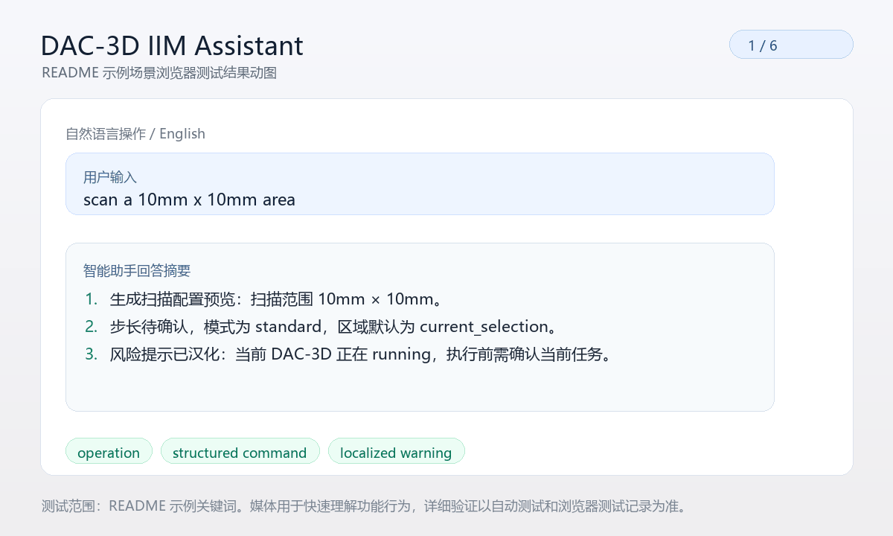

# DAC-3D IIM Assistant

DAC-3D IIM Assistant 是一个面向 DAC-3D 检测流程的中文优先智能交互助手。它不是通用聊天机器人，而是围绕 DAC-3D 手册、运行状态和检测结果构建的任务型原型，用来降低操作员培训成本。

## 产品目标

本项目覆盖四类核心能力：

- 自然语言操作，将 `scan a 10mm x 10mm area` 或 `扫描 10mm x 10mm 区域` 转成结构化扫描预览
- 文档问答，解释参数、流程、状态和手册内容
- 结果解读，结合结构化检测结果和缺陷阈值文档回答缺陷是否严重
- 操作指导，针对反光、扫描不稳定等现场问题给出依据明确的建议

## 当前交付形态

- 中文优先的本地知识库与持久化向量索引
- `mock` 和 `anthropic` 两种 LLM provider 接口
- `mock` DAC-3D 适配层和稳定的 live adapter seam
- `FastAPI` 后端接口和可嵌入 DAC-3D 侧边栏的 `React + Vite` 前端
- `Gradio` 旧版界面保留为兼容回退
- 结构化命令预览、状态展示、结果解析和来源显示
- OpenAI Agents SDK 入口，将现有 DAC-3D 助手能力暴露为 Agent 工具
- 工业设备信息管理 AI Agent 原型，内置 mock 设备状态、历史数据、报警记录、维护文档、规则异常分析和工具调用轨迹展示

## 仓库结构

- `app.py`: 应用启动、依赖组装、消息路由
- `agent_runtime.py`: OpenAI Agents SDK Agent 封装和工具注册
- `config.py`: 运行配置、环境变量读取、路径管理
- `knowledge_base/`: 文档、知识库构建与向量持久化
- `rag/`: 检索、提示词、LLM 适配层
- `intent/`: 意图识别和命令生成
- `integration/`: DAC-3D 访问边界和结果解析
- `ui/`: Gradio 兼容界面和 FastAPI 接口层
- `frontend/`: React + Vite 聊天前端
- `tests/`: 冒烟测试与模块测试
- `docs/`: 部署和运行说明

## 本地运行

在仓库根目录执行：

```bash
python -m pip install -e ".[dev]"
python knowledge_base/build_kb.py
cd frontend && npm install && npm run build && cd ..
python app.py --message "这个参数是什么意思？"
python app.py
python -m pytest tests -q
```

`python app.py`、`python app.py --message ...` 和 Web `/api/chat` 默认都走统一 Agent 入口：用户消息先交给 LLM，LLM 再通过 OpenAI Agents SDK 选择 `dac3d_*` 或 `machine_*` 工具。需要配置 `OPENAI_API_KEY`、`DAC3D_AGENT_API_KEY`，或继承 OpenAI-compatible 的 `DAC3D_LLM_API_KEY`：

```bash
export OPENAI_API_KEY="..."
python app.py --message "当前检测状态是什么？"
python app.py --agent --agent-model gpt-5.4-mini
python app.py --agent-web  # 兼容旧脚本；Web 默认已是 Agent 入口
```

如果要接第三方 OpenAI-compatible 模型，保持 DAC-3D 工具和控制 bridge 不变，只替换 Agent 的模型 endpoint：

```bash
export DAC3D_AGENT_MODEL_NAME="vendor/dac3d-control-model"
export DAC3D_AGENT_API_KEY="第三方模型 API Key"
export DAC3D_AGENT_API_BASE_URL="https://llm.example.com/v1"
export DAC3D_AGENT_API_TYPE="chat_completions"
python app.py --agent --message "确认立即开始在线扫描"
```

如果 `DAC3D_LLM_PROVIDER=openai_compatible` 已经配置好普通 DAC-3D-LLM 对话模型，Agent 会默认继承 `DAC3D_LLM_MODEL_NAME`、`DAC3D_LLM_API_KEY` 和 `DAC3D_LLM_API_BASE_URL`，并自动使用 `chat_completions`。需要单独给 Agent 换模型时，再设置 `DAC3D_AGENT_*`。

也可以用命令行覆盖：

```bash
python app.py --agent \
  --agent-model vendor/dac3d-control-model \
  --agent-api-base-url https://llm.example.com/v1 \
  --agent-api-type chat_completions \
  --message "当前检测状态是什么？"
```

Agent 会把现有 DAC-3D 助手和工业设备信息管理能力封装为工具，包括 `dac3d_answer`、`dac3d_operation`、`dac3d_preview_command`、`dac3d_execute_command`、`dac3d_status`、`dac3d_latest_result`、`dac3d_rebuild_knowledge_base`，以及 `machine_agent_chat`、`machine_status`、`machine_history`、`machine_alarms`、`machine_docs`、`machine_condition_summary`、`machine_abnormal_analysis`。其中 `dac3d_preview_command` 只生成结构化命令预览，`dac3d_execute_command` 会在用户明确确认、运行时不忙碌、离线目录校验通过后，把命令提交到 embedded bridge、file command bridge 或 mock runtime。

安装为 editable 包后，也可以使用 Agent-first 命令：

```bash
dac3d-agent --describe
dac3d-agent --list-tools
dac3d-agent --message "当前检测状态是什么？"
dac3d-agent --preview-command "start online scan"
dac3d-agent --execute-command "start online scan" --confirmed
```

这条入口不启动 Web UI，定位为可被脚本、终端演示或后续生产编排直接调用的 DAC-3D Agent 项目入口。`python app.py --assistant-router` 可临时切回旧的规则路由入口。真实 DAC-3D 主系统运行时，将 `DAC3D_ENDPOINT` 指向主系统发布的 `dac3d_runtime_status.json`，并设置 `DAC3D_COMMAND_PATH` 后，确认执行的 Agent 命令会写入 `dac3d_assistant_command.json`，由 `福特科/xxp_ui/window/ui.py` 轮询并触发在线扫描、离线检测或停止检测。

默认 `python app.py` 会启动 FastAPI 后端并尝试提供构建后的 React 前端。调试前端时也可以单独执行：

```bash
cd frontend
npm run dev
```

如果当前环境没有构建前端，或者你仍想使用旧版界面，也可以显式执行：

```bash
python app.py --cli
python app.py --gradio
```

## 工业设备信息管理 AI Agent 原型

当前 React 首页通过统一 `/api/chat` 入口即可询问设备状态、历史、报警和异常归因；`/api/machine-agent/*` 仍保留给仪表盘快照和兼容调用。它不是静态页面，而是读取 mock 设备数据、调用工具、检索文档并返回分析结果。

新增模块：

- `machine_agent/data_provider.py`：统一设备数据接口和 mock seed data，覆盖实时状态、历史记录、报警记录和设备文档。
- `machine_agent/agent.py`：规则型 Agent 服务，根据用户问题选择工具并组织回答。
- `machine_agent/analysis.py`：异常统计、报警高发时段、正常/异常数据差异和自然语言总结。
- `machine_agent/documents/`：示例设备操作手册、故障代码说明、维护保养规范和报警处理流程。

主要工具：

- `get_current_machine_status`
- `get_machine_history`
- `get_alarm_records`
- `search_machine_docs`
- `summarize_machine_condition`
- `detect_abnormal_patterns`

启动：

```bash
cd dac3d_iim_assistant
python app.py --web-only
```

访问：

```text
http://127.0.0.1:7890
```

推荐 demo 问题：

```text
现在设备状态怎么样？
上个月运行情况怎么样？
最近有哪些异常？
为什么最近温度报警变多了？
E102 错误代码是什么意思？
帮我总结一下这台机器最近三个月的问题。
```

也可以直接调用 API：

```bash
curl -X POST http://127.0.0.1:7890/api/machine-agent/chat \
  -H "Content-Type: application/json" \
  -d '{"message":"为什么最近温度报警变多了？"}'
```

## 示例场景

下面的动图展示了 README 示例关键词在助手中的测试结果摘要，便于快速了解每类能力的实际返回效果。



- `scan a 10mm x 10mm area`
- `扫描 10mm x 10mm 区域`
- `这个参数是什么意思？`
- `当前检测状态是什么？`
- `这个缺陷严重吗？`
- `样品太反光了应该怎么办？`

## 版本号规范

当前首个版本标签为 `v0.1.0`。

本项目使用语义化版本号（Semantic Versioning）并统一采用 `vMAJOR.MINOR.PATCH` 形式：

- `MAJOR`：出现不兼容变更时递增，例如 API、配置项或运行方式发生破坏性调整
- `MINOR`：向后兼容的新功能递增，例如新增意图类型、Web UI 能力或新的集成接口
- `PATCH`：向后兼容的问题修复递增，例如流式显示修复、检索精度修复、样式或稳定性修补

建议发布规则如下：

- 新的里程碑可用 `v0.2.0`、`v0.3.0` 持续推进原型能力
- 小范围修复使用 `v0.1.1`、`v0.1.2` 这类补丁版本
- 在 `1.0.0` 之前，功能仍可快速演进，但每次对外发布都应打 tag 并记录变更范围

## 主要限制

- 本阶段不接真实 DAC-3D 设备或 SDK，只提供 mock 运行时和清晰的适配接口
- 若未安装 `fastapi`、`uvicorn`、`react` 前端依赖或未构建 `frontend/dist`，默认 Web 入口无法完整工作
- 若未安装 `anthropic`、`chromadb`、`gradio`、`sentence-transformers`，系统会回退到离线可运行路径
- 默认 `DAC3D_EMBEDDING_DOWNLOAD_ALLOWED=false`，若本机未缓存 embedding 模型，会快速回退到 hashing embedding；需要联网下载模型时再显式开启
- 默认知识库只包含仓库内样例文档，真实项目需要补充 DAC-3D 官方手册、FAQ 和检测规则文档
- 本地 embedding 默认兼容中英双语，若语料完全中文，可通过配置切换为中文专用模型
